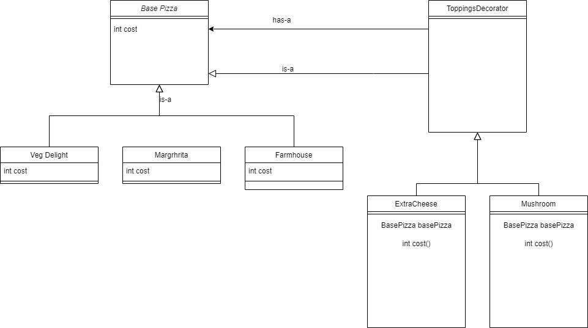

# Design-Pattern
This repository contains all code of design patterns

1.  Implementation of stategy design pattern

Strategy pattern is a behavioral design pattern that allows the behavior of an object to be selected at runtime. It is one of the Gang of Four (GoF) design patterns, which are widely used in object-oriented programming.

The Strategy pattern is based on the idea of encapsulating a family of algorithms into separate classes that implement a common interface. The pattern consists of three main components: the Context, the Strategy, and the Concrete Strategy.

The Context is the class that contains the object whose behavior needs to be changed dynamically. The Strategy is the interface or abstract class that defines the common methods for all the algorithms that can be used by the Context object. The Concrete Strategy is the class that implements the Strategy interface and provides the actual implementation of the algorithm

3. Decorator Design pattern

